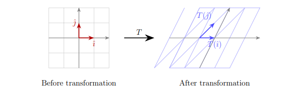

___

# Ánh xạ là gì?
Một ánh xạ là một hàm mà nó chuyển vector này sang vector khác.

Mỗi một input vector sẽ chỉ đến một output vector.

$$
T : \mathbb R ^ 2 \rightarrow \mathbb{R^2}
$$

___
# Ánh xạ tuyến tính

Một **Linear Transformation** nếu nó thỏa hai điều kiện sau đây:

1. **Additivity:**   $T(\mathbf v + \mathbf w) = T(\mathbf v) + T(\mathbf w)$
1. **Homogeneity:**   $T(c \cdot \mathbf v) = c \cdot T(\mathbf v)$

Với các vector $v, w$ và **scalar** c bất kỳ.

:::{.callout-note collapse="true"} 
## Geometric Intuition
Một ánh xạ tuyến tính sẽ bóp méo các vector cơ sở, sao cho thỏa mãn:

1. **Các đường thẳng vẫn thẳng.** (Không thể nào cong được)
2. **Gốc tọa độ phải giữ nguyên.**

Nếu các đường lưới vẫn song song và cách đều nhau sau phép biến đổi, thì đó là phép biến đổi tuyến tính.

:::

___
# Ma trận của Linear Transformation

Với mỗi Linear Transformation $T : \mathbb{R^2} \rightarrow \mathbb{R^2}$ đều có thể hoàn toàn xác định nơi mà hai vector basis của mình $\hat{i}$ và $\hat{j}$ ở đâu sau khi ánh xạ.

:::{.callout-tip}
## Proof

Với bất kỳ vector $\mathbf{v} = \begin{bmatrix} x \\ y \end{bmatrix}$ đều có thể viết dưới dạng: $\mathbf v = x \hat i + y \hat j$.

Sử dụng tính chất tuyến tính:

$$
T(\mathbf v) = T(x \hat i + y \hat j) = x T(\hat i) + y T(\hat j)
$$

Vì thế, nếu chúng ta biết được $T(\hat i)$ và $T(\hat j)$ hay là vị trí của hai vector basis $\hat{i}$ và $\hat{j}$ ở đâu sau khi áp $T()$.
:::

Nếu $T(\hat i) = \begin{bmatrix} a \\ c \end{bmatrix}$ và $T(\hat j) = \begin{bmatrix} b \\ d \end{bmatrix}$, **Transformation Matrix** của $T$ là:

$$
A = \begin{bmatrix} a & b \\ c & d \end{bmatrix}
$$

___
# Một số ví dụ về những cái ánh xạ quan trọng

## Rotation

**Phép quay:** một phép quay một góc $\theta$ ngược chiều:

$$
\mathbf{A}_{\theta} = \begin{bmatrix}
\cos\theta & -\sin\theta \\ 
\sin\theta & \cos\theta
\end{bmatrix}
$$

## Scaling

**Phép co dãn:** phóng trục hoành một lượng $x$ và trục tung một lượng $y$

$$
\mathbf A = \begin{bmatrix}
x & 0 \\ 
0 & y
\end{bmatrix}
$$

## Shear

**Phép cắt:** một trục sẽ giữ nguyên hướng, trong khi đó trục còn lại sẽ bị thay đổi một lượng $k$.

Ví dụ:

## Reflection

::: {.problems}
ádfasdf
:::