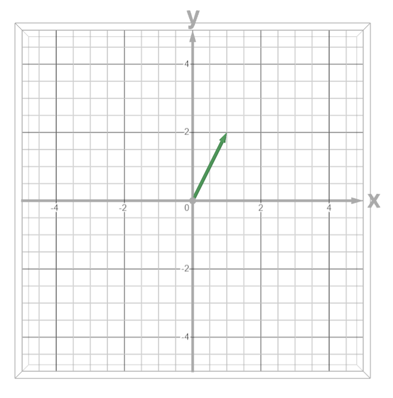

Một cách khá hay để hiểu về Ma trận là cái gì, đó là tưởng tượng nó trong không gian.

Thử tưởng tượng rằng bạn có một vector trong không gian n chiều, có chiều từ $O(0, 0, .. 0) \in  \mathbb R ^ n$, tới $A(a_1, a_2, a_3, ... a_n) \in \mathbb R^n$.

Ví dụ: Vector $\vec v (1, 2)$.

## Ma trận cột

Ta có thể biểu diễn Vector $\vec v$ trên bằng ma trận cột $1 \times 2$, được ký hiệu như sau:

$$
\begin{bmatrix}
1 \\
2
\end{bmatrix}
$$

Hay tổng quát hơn, ta có thể biểu diễn một vector nhiều chiều bằng ma trận cột gồm n giá trị
$$
\begin{bmatrix}
a_1 \\ 
a_2 \\ 
a_3 \\ 
\vdots \\ 
a_n
\end{bmatrix}
$$

## Ma trận $n \times m$
Là tập hợp của m vector n chiều.

$$
\begin{bmatrix}
a_{11} & a_{12} & \cdots & a_{1m} \\ 
a_{21} & a_{22} & \cdots & a_{2m} \\ 
\vdots & \vdots & \ddots & \vdots \\ 
a_{n1} & a_{n2} & \cdots & a_{nm} \\ 
\end{bmatrix}
$$
