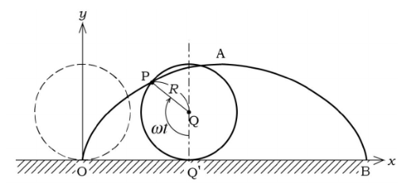

___
# Lời bạt 
Thật ra lời bạt là lời nói ở cuối sách cơ, nhưng mà thôi, chấp nhận đi.

Vector trong những lời tôi nói, ví dụ, và viết, suy nghĩ trong đầu bạn, ở chương **18.02** nên là vector trong mặt phẳng (2D), hoặc trong không gian 3 chiều (3D).

Các tính chất hầu như (tất cả) đều giống nhau ở đa chiều khác nhau, nhưng sẽ dễ dàng và để chương **18.06** không bị mất đi tinh thần của nó. Các ví dụ trong chương này nên là 2d và 3d cho dễ hiểu.


___
# Vectors

:::{.callout-note}
Các quan điểm về Vector của Toán học, Vật lý, và Tin học sẽ bàn rõ hơn ở **18.06**.
:::

ector có hai thứ để cấu tạo nên nó:

* $dir(\vec A)$ : direction 
* $|\vec A|$ : magnitude / length

Một vector cơ bản giới thiệu trong không gian ba chiều sau:

$$
\vec A = a_1 \hat i + a_2 \hat j + a_3 \hat k = <a_1, a_2, a_3>
$$

Một vector cũng có thể biểu diễn bằng hai điểm, ví dụ như là hai điểm P và Q thì vector $\vec{PQ}$ sẽ có đầu là điểm P và kết thúc ở điểm Q.

## Độ dài của vector

Ở cấp 3 chúng ta đã được học, nó chính là 

$$
\vec A <a_1, a_2, a_3> = \sqrt{\left(a_1^2 + a_2^2 + a_3^2 \right)}
$$

## Cộng vector và nhân vector với scalar

**18.06**

##

:::{.callout-warning}
## Lưu ý 
Lưu ý rằng, các vector có cùng hướng và cùng độ dài là giống nhau, không quan trọng điểm đặt của nó.
Điều này tớ cho rằng nó sẽ dễ dàng hơn trong việc truyền đạt phép cộng và nhân vector với một số sau này.
:::
___
# Dot product

Như ở cấp 3 ta đã học. Tổng quát hóa nó lên, tích vô hướng hai vector là:

$$
\vec A \cdot \vec B = \sum{a_i b_i}
$$

Và một cách khác theo hình học là:

$$
\vec A \cdot \vec B = |\vec A| \cdot |\vec B| \cdot \cos(\theta)
$$

:::{.callout-tip}
## Chứng minh


:::

## Applications

Ứng dụng của dot product: 

* 1. Tính độ dài và góc (đặc biệt là góc)
* 2. Xác định tính trực giao

___
# Determinants

Định thức, như ở cấp 3 chúng ta đã được học định thức bậc nhất:

$$
\begin{vmatrix}
a_1 & a_2 \\ 
b_1 & b_2
\end{vmatrix} = a_1b_2 - a_2b_1
$$

Và bây giờ tớ sẽ giới thiệu tới định thức $3 \times 3$

$$
\begin{vmatrix}
a_1 & a_2 & a_3 \\ 
b_1 & b_2 & b_3 \\ 
c_1 & c_2 & c_3
\end{vmatrix} 
= a_1 \begin{vmatrix}
b_2 & b_3 \\ 
c_2 & c_3 
\end{vmatrix}
- a_2 \begin{vmatrix}
b_1 & b_3 \\ 
c_1 & c_3 
\end{vmatrix}
+ a_3 \begin{vmatrix}
b_1 & b_2 \\ 
c_1 & c_2 s
\end{vmatrix}
$$

Còn $\det(A_{n \times n})$ thì sẽ được giới thiệu ở **18.06**

Một ứng dụng của định thức là diện tích tam giác tạo bởi hai vector $\vec A$ và $\vec B$.


___
# Cross product


___
# Matrices

Ma trận là gì? Có lẽ sẽ được nói rõ hơn trong **18.06** nhưng bây giờ chúng ta sẽ hiểu nó đơn giản là một tập hợp các số nén trong một bảng $n \times m$ n,m tùy ý.

Thường thì các đại lượng có liên hệ với nhau qua biến đổi tuyến tính; Ví dụ như là việc thay đổi hệ tọa độ, không phải là $\hat i = <1, 0, 0>$, $\hat j = <0, 1, 0>$, $\hat k = <0, 0, 1>$ nữa, mà sẽ là 3 vector tùy ý làm gốc tọa độ, vậy thì vector gốc ban đầu $\vec V$ sẽ ở đâu sau khi biến đổi tuyến tính.

For example:

$$
\begin{cases}
u_1 = 2x_1 + 3x_2 + 3x_3 \\ 
u_2 = 2x_1 + 4x_2 + 5x_3 \\ 
u_3 = x_1 + x_2 + 2x_3
\end{cases}
$$

Khi viết dưới dạng nhân ma trận, sẽ là:

$$
\begin{bmatrix}
2 & 3 & 3 \\ 
2 & 4 & 5 \\ 
1 & 1 & 2  
\end{bmatrix}
\begin{bmatrix}
x_1 \\ 
x_2 \\ 
x_3
\end{bmatrix}
=
\begin{bmatrix}
u_1 \\ 
u_2 \\ 
u_3 
\end{bmatrix}
$$

i.e. $AX = U$

Việc nhân ma trận như thế nào, không cần bàn cãi gì nữa, nó là công việc của **18.06**, nhưng nếu bạn là học sinh chuyên tin thì sẽ biết nó hoạt động như thế nào.

Đơn giản mà nói, nó sẽ là tích vô hướng giữa các hàng $i$ ma trận A và các cột $j$ của X, nó sẽ cho ra giá trị $a_{ij}$ của ma trận U.

:::{.callout-warning collapse="true"}
## Lưu ý
Chính vì thế nên chiều dài của A phải bằng chiều cao của X.
:::

## Identity matrix

Ma trận đơn vị là ma trận có số 1 ở đường chéo chính và tất cả số 0 ở các vị trí còn lại, ví dụ:

$$
I_{3 \times 3} = \begin{bmatrix}
1 & 0 & 0 \\ 
0 & 1 & 0 \\ 
0 & 0 & 1
\end{bmatrix}
$$

và 

$$
IX = X 
$$

vì ma trận này không làm gì cả, đối chiếu với biến đổi tuyến tính, thì nó chính là không làm gì cả. Vì ma trận đơn vị này chính là hợp lại của các vector basis. ;)

## Inverse matrix

Ta thường giải $Ax = B \Rightarrow x = \frac B A = A^{-1}B$. Vậy chúng ta có thể áp dụng nó trong ma trận được không?

Được👍🏿.

Vậy chúng ta tính $A^{-1}$ như thế nào.

Bằng một cách thần kỳ, chúng ta biết được công thức $A^{-1} = \frac 1 {\det(A)} adj(A)$. 
(Trong đó adj(A) là ma trận phụ hợp - adjoint matrix).

Cách tính adj(A). Với mỗi giá trị hàng i cột j của bảng $3 \times 3$, ta sẽ bỏ đi hàng i và cột j đó, chỉ còn lại bảng $2 \times 2$, và giá trị $adj(A)_{ij}$ sẽ là định thức của bảng đó.

Và thêm một bước nữa là chuyển vị bảng hiện tại, tức là tính $adj(A)^T$ sẽ cho bảng $adj(A)$ mà ta đang cần.

Bước cuối cùng là tính $\det(A)$.

:::{.callout-tip}
## tip
Như bạn đã suy nghĩ:

$$
A^{-1}A = I
$$
:::

___
# Square systems; Equation of planes

## Suy nghiệm 

Như ở trước ta đã đề cập, chúng ta có thể dùng $X = A^{-1}B$ để tính nghiệm của hệ phương trình. Và công thức để tính ma trận nghịch đảo là $A^{-1} = \frac 1 {\det(A)} \cdot adj(A)$. Nhưng chúng ta chưa đề cập đến một việc, đó là mẫu số, hay chính là $\det(A)$ có thể bằng 0.

Vì vậy, chúng ta sẽ suy luận ra nghiệm của hệ phương trình.

Nếu $\det(A) \neq 0$ thì A sẽ được gọi là ma trận khả nghịch.

## Homogeneous Systems

Đó là khi AX = 0, cả 3 mặt phẳng đều đi qua gốc tọa độ.

Khi B = 0, tức là hệ phương trình gồm các phương trình có hệ số tự do = 0. Thì khi đó chúng ta có nghiệm tầm thường, đó chính là khi $x, y, z, ... = 0$.

Nghiệm tầm thường chỉ xảy ra khi ma trận A là khả nghịch, nếu ma trận A không khả nghịch, chúng ta sẽ có vô số nghiệm.

## General Systems 

Đó là khi AX = B, cả 3 mặt phẳng đều dịch chuyển song song so với mặt phẳng ban đầu mà cắt gốc tọa độ của nó.

Nếu ma trận khả nghịch, thì chỉ có một đáp án duy nhất đó chính là $X = A^{-1}B$.

Nếu ma trận không khả nghịch, thì có hai khả năng là vô số nghiệm hoặc là vô nghiệm, chúng ta phải dùng khử Gauss để xác định xem là trường hợp nào, điều mà chắc chắn sẽ nói rõ hơn trong **18.06**.

___
# Parametric equations for lines and curves 


## Phương trình tham số cho đường thẳng
Căn bản là giống cấp 3. Một hệ phương trình có vector chính phương (hoặc là 2 điểm AB trên đường thẳng đó tạo thành vector chính phương) $\vec v = <a, b, c>$ và điểm $A = (x, y, z)$ như sau:

$$
\begin{cases}
x(t) = x + at \\ 
y(t) = y + bt \\ 
z(t) = z + ct 
\end{cases}
$$

Sẽ tưởng tượng rằng là có một điểm $P(t) = (x(t), y(t), z(t))$ chạy trên đường thẳng đó.

## Phương trình tham số cho đường cong Cycloid

:::{.callout-tip collapse="true"}
## Đường cong Cycloid
Đường cong cycloid là một quỹ đạo cong được vẽ bởi một điểm nằm trên vành một đường tròn khi đường tròn đó lăn không trượt trên một mặt phẳng.


:::

Có rất nhiều tham số có thể để lập phương trình, như là thời gian, góc, bán kính, ...

Nhưng chúng ta sẽ sử dụng góc, hay chính là $\theta$.

Ta biết được rằng phương trình Vector $\vec {OB}$ (trong đó O là gốc tọa độ, B là điểm trên đường cong) chính là $\vec {OA} + \vec {AI} + \vec {IB} $ (trong đó, A là điểm tiếp xúc giữa đường trong và trục X, I là tâm đường tròn).

Ta có: 

$$
\vec {OB} = <t - sin(t), 1 - cos(t)>
$$

___
# Velocity

Tiếp tục với đường cong **cycloid**.

Và chúng ta đang cố gắng tìm một điểm $P(x(t), y(t), z(t))$, là điểm nằm trên đường cong và di chuyển theo thời gian $t$.

## Position vector and Velocaity vector

**Position vector** là vector nối từ gốc tọa độ đến điểm, chính là vector $\vec {OB}$, và nó cũng chính là $\vec v (t) = <x(t), y(t), z(t)>$.

**Velocity vector** : chúng ta muốn biết độ lớn của vận tốc, hay chính là tốc độ và hướng của nó, vậy cách tốt nhất là dùng vector, hay ở đây chính là vector vận tốc.

$$
\vec v = \frac {\mathbf d \vec r}{\mathbf d t} = <\frac{\mathbf d x }{\mathbf d t}, \frac{\mathbf d y }{\mathbf d t}, \frac{\mathbf d z }{\mathbf d t}>
$$

:::{.callout-tip collapse="true"}
## Ví dụ với cycloid

Ta có $\vec r(t) = <t - sin(t), 1 - cos(t)>$, vậy vector vận tốc là:

$$
\vec v = <1 - cos(t), sin(t)>
$$

Chính vì thế, ngay tại thời điểm $t = 0$, $\vec v = 0$ và tốc độ $|\vec v| = 0$.
:::

___
# Acceleration

**Tưởng tượng** bạn đang di chuyển một chiếc xe ô tô, và nó luôn duy trì ở tốc độ 50 km/h, bất kể khi vào cua! Và khi vào cua đó, bạn nghĩ rằng gia tốc của mình không hề thay đổi, vì tốc độ của mình luôn là một hằng số. Nhưng điều đó là sai, một điều khá trái với trực giá. Gia tốc là một đại lượng có hướng, vì vậy khi thay đổi góc để vào cua, vận tốc đã thay đổi!

Công thức tính gia tốc là:

$$
\vec a(t) = \frac{\mathbf d \vec v}{\mathbf d t }
$$

:::{.callout-warning collapse="true"}
## Chú ý
Tốc độ là $|\vec v| = \left|\frac {\mathbf d \vec r}{\mathbf d t} \right|$, thứ mà chắc chắn là không bằng với $\frac {\mathbf d |\vec r|}{\mathbf d t }$.
:::
___
# Kepler's second law

Bài đọc thêm, nếu thích, hãy đọc cái bên dưới:

:::{.callout-note}
## Kepler 1609
To illustration of efficiency of vector methods, Kepler 1609, laws of planetarymotion: the motion of planets is in a plane, and area is swept out by the line from the sun to the planet at a constant rate. Issac Newton (about 70 years later) explained this using laws of gravitational
attraction.

Kepler’s law in vector form: area swept out in $\Delta t$ is area $\approx \frac 1 2 |\vec r \times \Delta \vec r| \approx \frac 1 2 |\vec r \times \vec v| \Delta t$ 
So $\frac {\mathbf d }{\mathbf d t}(\text{area}) = \frac 1 2 |\vec v \times \vec r|$ is constant.
Also, $\vec r \times \vec v$ is perpendicular to plane of motion, so $dir(\vec r \times \vec v) = const$
Hence, Kepler's 2nd law says: $\vec r \times \vec v = const$.


The usual product rule can be used to differentiate vector functions: $\frac{\mathbf d}{\mathbf d t}(\vec a \cdot \vec b), \frac{\mathbf d}{\mathbf d t}(\vec a \times \vec b)$, being
careful about non-commutativity of cross-product.

$$
\frac {\mathbf d}{\mathbf d t}(\vec r \times \vec v) = \frac{\mathbf d \vec r}{\mathbf d t} \times \vec v + \vec r \times \frac{\mathbf d \vec v}{\mathbf d t} = \vec v \times \vec v + \vec r \times \vec a = \vec v \times \vec a
$$

So Kepler’s law $\Leftrightarrow \vec r \times \vec v = const \Leftrightarrow \vec r \times \vec a = 0 \Leftrightarrow \vec a // \vec r \Leftrightarrow$ the force $\vec F$ is central.

(so Kepler’s law really means the force is directed $//\vec r$; it also applies to other central forces –
e.g. electric charges.)
:::

# Exam 1A

<!-- ```{=html}
<iframe
  src="../../doc/multivariable-calculus/exam_1A.pdf"
  width="100%"
  height="700"
  border-radius=15px>
</iframe>
``` -->

```{=html}
<div style="
  border-radius: 16px;
  overflow: hidden;
  box-shadow: 0 8px 24px rgba(0,0,0,0.15);
  border: 1px solid #e5e7eb;
">
  <iframe
    src="../../doc/multivariable-calculus/exam_1A.pdf"
    width="100%"
    height="700"
    style="border: none;">
  </iframe>
</div>
```