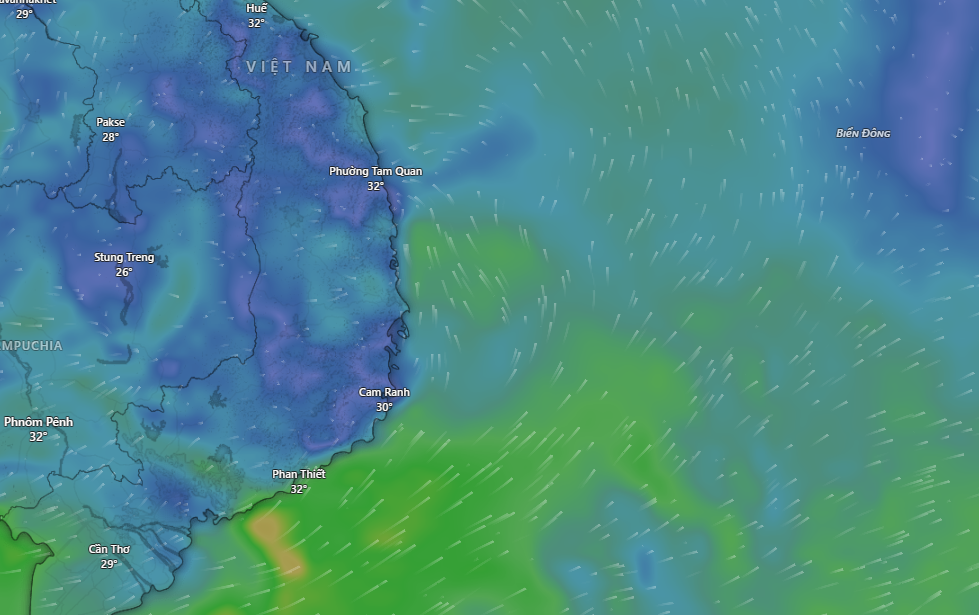

___
# Double integrals

## Cách tính

Gồm 2 bước để tính $\int \int S(x,y) \mathbf dx \mathbf dy$

1) inner integral : giữ x là const
2) outer integral : tính như bình thường

**Ví dụ:** $\int_0^1 \int_0^1 (1 - x^2 - y^2) \mathbf dy \mathbf dx$

1) 
$$
\int_0^1(1 - x^2 - y^2)\mathbf dy = \left [y - x^2y - \frac {y^3} 3 \right]_0^1 = \frac 2 3 - x^2
$$

2)
$$
\int_0^1\left(\frac 2 3 - x^2 \right)\mathbf dx = \left[\frac 2 3 x - \frac 1 3 x^3\right]_0^1 = \frac 1 3
$$

## Thử đổi thứ tự 

Đầu tiên, phải nói rằng:
$$
\int_{x_{min}}^{x_{max}} \int_{y_{min(x)}}^{y_{max(x)}}S(x, y)\mathbf dy \mathbf dx
=\int_{y_{min}}^{y_{max}} \int_{x_{min(y)}}^{x_{max(y)}}S(x, y)\mathbf dx \mathbf dy
$$

Tức là dù có tính cái nào trước, đáp án vẫn là như nhau. Một số trường hợp việc đổi thứ tự có giúp việc tính tích phân dễ hơn hoặc khó hơn.

**Ví dụ:** 
$$
\int_0^1 \int_x^{\sqrt x} \frac {e^y}{y} \mathbf dy \mathbf dx
$$

```{python}
#| echo: true
#| code-fold: true
#| warning: false
import numpy as np
import matplotlib.pyplot as plt

# Miền x
x = np.linspace(-0.5, 1.5, 500)

# Hàm y = x
y1 = x

y2 = np.where(x >= 0, np.sqrt(x), np.nan)

plt.figure(figsize=(6, 6))

# Vẽ hai đường
plt.plot(x, y1, label=r"$y=x$", linewidth=2)
plt.plot(x, y2, label=r"$y=\sqrt{x}$", linewidth=2)

mask = (x >= 0) & (x <= 1)
plt.fill_between(
    x[mask],
    y1[mask],
    y2[mask],
    color="black",
    alpha=0.3
)

# Trục tọa độ
plt.axhline(0, color="black", linewidth=1)
plt.axvline(0, color="black", linewidth=1)

plt.xlim(-0.5, 1.5)
plt.ylim(-0.5, 1.5)
plt.gca().set_aspect("equal", adjustable="box")

plt.xlabel("$x$")
plt.ylabel("$y$")
plt.legend()
plt.grid(alpha=0.3)

plt.show()
```

:::{.callout-tip collapse="true"}
## Cách tư duy vẽ hình.

$$
\int_a^b \int_{c(x)}^{d(x)} S(x, y) \mathbf dy \mathbf dx
$$

Nó sẽ là 2 đường thẳng là tập hợp các điểm 
$c(x) \left\{ x \in \mathbb r | a \leq x \leq b \right\}$
$d(x) \left\{ x \in \mathbb r | a \leq x \leq b \right\}$.
:::

1) Giữ nguyên.

Có thể thấy rằng việc tính **inner integral** $\int_x^{\sqrt x}\frac {e^y} y \mathbf dy$ rất khó.

2) Đổi thứ tự.

:::{.callout-warning}
## Chú ý!
Nên nhớ rằng khi việc đổi thứ tự thì 2 biên cũng sẽ thay đổi!
:::

Lúc này hàm trở thành:

$$
\int_0^1 \int_{y^2}^y \frac {e^y} y \mathbf dx \mathbf dy
$$

**Innner** 
$$
\int_{y^2}^y \frac {e^y} y \mathbf dx = \left[ \frac {e^y} y x \right]_{y^2}^y = e^y - ye^y
$$

**Outer**

$$
\int_0^1 \left(e^y - ye^y \right) \mathbf dy = \left[ -ye^y + 2e^y \right]_0^1 = e - 2
$$


___
# Integration in polar coordinates

Không chỉ việc đổi thứ tự tích phân giúp tính tích phân dễ dàng hơn. Chúng ta cũng có một phương pháp khác là sử dụng tọa độ cực.

Cách chuyển hàm trên tọa độ Đề các sang tọa độ cực, đó là chuyển:

* $x = r\cos\theta$
* $y = r\sin\theta$

Vậy nên: $\int\int S \mathbf dA = \int\int S_\theta r\mathbf dr \mathbf d\theta$. 
($\mathbf dA = \mathbf dx \mathbf dy = r\mathbf dr \mathbf d\theta \neq \mathbf dr \mathbf d\theta$)

**Ví dụ**

Tính:
$$
\int \int_{x^2+y^2 \leq 1, x \geq0, y \geq 0}(1 - x^2 - y^2)\mathbf dx \mathbf dy 
\Rightarrow
\int_0^{\pi/2}\int_0^1 (1 - r^2)r \mathbf dr \mathbf d\theta
$$

**Inner**
$$
\int_0^1 (r - r^3) \mathbf dr \mathbf =
\left[ \frac 1 2 r^2 - \frac 1 4 r^4 \right]_0^1 =
\frac 1 4 
$$

**Outer**
$$
\int_0^{\pi/2} \frac 1 4 \mathbf d\theta = \frac \pi 8 
$$

___
# Change of variables

Ngoài việc đổi thứ tự tích phân, đổi sang tọa độ cực. Thì chúng ta có thêm một phương pháp nữa để tính tích phân trong một số trường hợp, đó là đổi biển.

## Đổi biến

**Ví dụ** việc tính:

$$
\int_0^1\int_0^1 (3x-2y)(x+y) \mathbf dx \mathbf dy
$$

Tôi cảm thấy quá khó, vậy nên tôi có thể thử đổi biến. Đặt $u = (3x-2y) \qquad v = (x+y)$, phương trình bây giờ trở thành:

$$
\int_a^b \int_c^d (uv) |J| \mathbf du \mathbf dv
$$

Và giờ việc của chúng ta là phải tính lại biên và tính $\lambda$, bằng cách sử dụng **Jacobian** và một số tư duy hình học để tính biên.


## Jacobians

Ta có công thức xấp xỉ như sau:

$$
\Delta u \approx u_x\Delta x + u_y\Delta y \qquad 
\Delta v \approx v_x\Delta x + v_y\Delta y
$$
$$
\Rightarrow 
\begin{bmatrix}
\Delta u \\ 
\Delta v
\end{bmatrix} 
\approx
\begin{bmatrix}
u_x & u_y \\ 
v_x & v_y
\end{bmatrix}
\begin{bmatrix}
\Delta x \\ 
\Delta y
\end{bmatrix}
$$

Vậy hệ số $\frac{\mathbf du \mathbf dv}{\mathbf dx \mathbf dy}$ sẽ phải là định thức của ma trận vuông kia.

:::{.callout-tip collapse="true"}
## Tại sao?
Việc này nếu chưa học **18.06** thì khá là khó để suy nghĩ. Nhưng hãy suy nghĩ như thế này.

Ta có 2 hình, bên trái chỉ $\mathbf dA = \mathbf dx \mathbf dy$ và bên phải là $\mathbf dA' = \mathbf du \mathbf dv$, việc của chúng ta là tính hệ số diện tích của nó. Hay chính là chúng thu to hay thu nhỏ với hệ số bao nhiêu.

```{python}
#| echo: true
#| code-fold: true
#| warning: false
import numpy as np
import matplotlib.pyplot as plt

fig, axes = plt.subplots(1, 2, figsize=(12, 6))
ax = axes[0]

ax.axhline(0, color='black')
ax.axvline(0, color='black')

e1 = np.array([1, 0])
e2 = np.array([0, 1])

ax.quiver(0, 0, e1[0], e1[1],
          angles='xy', scale_units='xy', scale=1,
          color='C0', width=0.008)

ax.quiver(0, 0, e2[0], e2[1],
          angles='xy', scale_units='xy', scale=1,
          color='C0', width=0.008)

square = np.array([
    [0, 0],
    [1, 0],
    [1, 1],
    [0, 1]
])

ax.fill(square[:,0], square[:,1], color='gray', alpha=0.35)

ax.text(1.05, -0.08, r'$(1,0)$')
ax.text(-0.15, 1.05, r'$(0,1)$')
ax.text(-0.08, -0.12, r'$O$')

ax.set_xlim(-0.5, 1.6)
ax.set_ylim(-0.5, 1.6)
ax.set_aspect('equal')
ax.set_xlabel("$x$")
ax.set_ylabel("$y$")
ax.grid(True)


ax = axes[1]

ax.axhline(0, color='black')
ax.axvline(0, color='black')

u = np.array([3, 1])
v = np.array([-2, 1])

ax.quiver(0, 0, u[0], u[1],
          angles='xy', scale_units='xy', scale=1,
          color='C0', width=0.008)

ax.quiver(0, 0, v[0], v[1],
          angles='xy', scale_units='xy', scale=1,
          color='C0', width=0.008)

parallelogram = np.array([
    [0, 0],
    u,
    u + v,
    v
])

ax.fill(parallelogram[:,0], parallelogram[:,1],
        color='gray', alpha=0.35)

ax.text(u[0]+0.1, u[1], r'$(3,1)$')
ax.text(v[0]-0.9, v[1], r'$(-2,1)$')
ax.text((u+v)[0]+0.1, (u+v)[1]+0.05, r'$(1,2)$')
ax.text(-0.08, -0.12, r'$O$')

ax.set_xlim(-3.5, 4)
ax.set_ylim(-1, 3)
ax.set_aspect('equal')
ax.set_xlabel("$u$")
ax.set_ylabel("$v$")
ax.grid(True)

plt.tight_layout()
plt.show()
```

Và thứ chúng ta đang tìm chính là định thức của ma trận? (Toi khong biet giai thich nhu the nao nua, hay chco **18.06 Linear Algebra**).
:::

:::{.callout-warning}
## Định nghĩa
the Jacobian is 
$$
J = \frac{\partial(u, v)}{\partial(x, y)} = 
\begin{vmatrix}
u_x & u_y \\
v_x & v_y
\end{vmatrix}
$$

Then
$$
\mathbf du \mathbf dv = |J|\mathbf dx \mathbf dy = \frac{\partial(u, v)}{\partial(x, y)} \mathbf dx \mathbf dy
$$
:::

**Ví dụ** Chuyển hệ tọa độ Đề-các sang tọa độ cực.

Ta đặt $x = r\cos\theta \qquad y = r\sin\theta$.

The Jacobian: 
$$
J  = \frac{\partial(x, y)}{\partial(r, \theta)} = 
\begin{vmatrix}
x_r & x_{\theta} \\
y_r & y_{\theta}
\end{vmatrix} = 
\begin{vmatrix}
\cos\theta & -r\sin\theta \\ 
\sin\theta & r\cos\theta
\end{vmatrix} = 
r\cos^2\theta + r\sin^2\theta = r
$$

Vậy suy ra: $\mathbf dx \mathbf dy = r \mathbf dr \mathbf d\theta$.


## Tính biên - notyet

___
# Vector fields

Trường vector có khá nhiều ứng dụng trong đời sống, như biểu đồ gió:

hay là trường lực, trường hấp dẫn, ...

$$
\vec F = M\hat{\mathbf i} + N\hat{\mathbf j}, \qquad M = M(x, y), N = N(x, y) 
$$

Mỗi điểm trong mặt phẳng đều có môt vector $\vec F$, vector này phụ thuộc vào x, y.

Một số hình ảnh ví dụ về trường Vector.

**Ví dụ 1** $\vec F = 2 \hat{\mathbf i} + \hat{\mathbf j}$
```{python}
#| echo: true
#| code-fold: true
#| warning: false
import numpy as np
import matplotlib.pyplot as plt

x = np.linspace(-3, 3, 15)
y = np.linspace(-3, 3, 15)
X, Y = np.meshgrid(x, y)

U = np.full_like(X, 2.0)
V = np.full_like(Y, 1.0)

magnitude = np.sqrt(U**2 + V**2)

plt.figure(figsize=(6, 6))
q = plt.quiver(
    X, Y, U, V,
    magnitude,
    cmap="viridis",
    angles="xy",
    scale_units="xy",
    scale=8,
    pivot="mid"
)

plt.colorbar(q, label=r"$|\mathbf{F}|$")
plt.xlim(-3.5, 3.5)
plt.ylim(-3.5, 3.5)
plt.gca().set_aspect("equal")
plt.grid(True)
plt.show()
```

Mọi vector đều cùng hướng, cùng độ lớn tại mọi điểm.

**Ví dụ 2** $\vec F = x \hat{\mathbf i}$

```{python}
#| echo: true
#| code-fold: true
#| warning: false
import numpy as np
import matplotlib.pyplot as plt

x = np.linspace(-3, 3, 15)
y = np.linspace(-3, 3, 15)
X, Y = np.meshgrid(x, y)

U = X
V = np.zeros_like(X)

magnitude = np.sqrt(U**2 + V**2)

plt.figure(figsize=(6, 6))
q = plt.quiver(
    X, Y, U, V,
    magnitude,
    cmap="viridis",
    angles="xy",
    scale_units="xy",
    scale=8,
    pivot="mid"
)

plt.colorbar(q, label=r"$|\mathbf{F}|$")
plt.xlim(-3.5, 3.5)
plt.ylim(-3.5, 3.5)
plt.axhline(0, color="black", linewidth=0.8)
plt.axvline(0, color="black", linewidth=0.8)
plt.gca().set_aspect("equal")
plt.grid(True)
plt.show()
```

**Ví dụ 3** $\vec F = x \hat{\mathbf i} + y \hat{\mathbf j}$
```{python}
#| echo: true
#| code-fold: true
#| warning: false
import numpy as np
import matplotlib.pyplot as plt

x = np.linspace(-3, 3, 15)
y = np.linspace(-3, 3, 15)
X, Y = np.meshgrid(x, y)

U = X
V = Y

magnitude = np.sqrt(U**2 + V**2)

plt.figure(figsize=(6, 6))
q = plt.quiver(
    X, Y, U, V,
    magnitude,
    cmap="viridis",
    angles="xy",
    scale_units="xy",
    scale=10,
    pivot="mid"
)

plt.colorbar(q, label=r"$|\mathbf{F}|$")
plt.xlim(-3.5, 3.5)
plt.ylim(-3.5, 3.5)
plt.axhline(0, color="black", linewidth=0.8)
plt.axvline(0, color="black", linewidth=0.8)
plt.gca().set_aspect("equal")
plt.grid(True)
plt.title(r"$\mathbf{F}=x\mathbf{i}+y\mathbf{j}$")
plt.show()
```

**Ví dụ 4** $\vec F = -y \hat{\mathbf i} + x\hat{\mathbf j}$

```{python}
#| echo: true
#| code-fold: true
#| warning: false
import numpy as np
import matplotlib.pyplot as plt

x = np.linspace(-3, 3, 15)
y = np.linspace(-3, 3, 15)
X, Y = np.meshgrid(x, y)

U = -Y
V = X

magnitude = np.sqrt(U**2 + V**2)

plt.figure(figsize=(6, 6))
q = plt.quiver(
    X, Y, U, V,
    magnitude,
    cmap="viridis",
    angles="xy",
    scale_units="xy",
    scale=10,
    pivot="mid"
)

plt.colorbar(q, label=r"$|\mathbf{F}|$")
plt.xlim(-3.5, 3.5)
plt.ylim(-3.5, 3.5)
plt.xlabel("$x$")
plt.ylabel("$y$")
plt.axhline(0, color="black", linewidth=0.8)
plt.axvline(0, color="black", linewidth=0.8)
plt.gca().set_aspect("equal")
plt.grid(True)
plt.title(r"$\mathbf{F}=-y\mathbf{i}+x\mathbf{j}$")
plt.show()
```

___
# Line integrals

## Công

$A = Fs = \vec F \cdot \Delta \vec r$ cho một chuyển động nhỏ $\Delta \vec r$. Tổng công được tính bằng cách tính tổng các cái này theo một quỹ đạo C.

Tưởng tượng có một đường cong C. Một điểm di chuyển trên quỹ đạo đó, và có lực tại mỗi điểm là khác nhau. Công tại một điểm bằng tích vô hướng của F với vector tiếp tuyến tại điểm đó. Và tổng công là khi ta chia nhỏ các vector tiếp tuyến, đến vô hạn.

$$
W = \int_C \vec F \cdot \mathbf d\vec r \left(= \lim_{\Delta \vec r \rightarrow 0} \sum_i \vec F \cdot \Delta \vec r_i \right)
$$

## Cách tính tích phân đường

**Ví dụ** Tính $F = <2xy, x^2y>$ với đường $y = x^2$, $0 \leq x \leq 1$.

***Bước 1:*** Tham số hóa.

Ta sẽ cố biểu diễn x và y theo một biến, ở đây ta gọi là t. Ý nghĩa của t là tại t = 0, thì đang ở điểm $(0, 0)$ và tại t = 1 thì đang ở điểm $(1, 1)$.

$$
x = t \qquad \mathbf dx = 1\mathbf dt \\
y = t^2 \qquad \mathbf dy = 2t\mathbf dt
$$

***Bước 2:*** Tìm công thức.

Ta đã biết rằng:
$$
\int_C \vec F \cdot \mathbf d\vec r = \int_C <2xy, x^2y>\cdot<\mathbf dx, \mathbf dy> = \int_C 2xy\mathbf dx + x^2y\mathbf dy
$$

***Bước 3:*** Thay số vào và tính.

$$
\int_0^1 2tt^21\mathbf dt + t^2t^2 2t\mathbf dt
$$
$$
= \int_0^1 2t^3 + 2t^5 \mathbf dt
$$

$$
= \left[2 \frac {t^4} 4 \right]_0^1 + \left[2 \frac{t^6} 6 \right]_0^1 = \frac 1 2 + \frac 1 3 = \frac 5 6
$$

___
# Path independence

**Tính** Tích phân đường $C = C_1 + C_2 + C_3$ trong trường vector $\vec F = <y, x>$ sau:

```{python}
#| echo: true
#| code-fold: true
#| warning: false
import numpy as np
import matplotlib.pyplot as plt
from matplotlib.collections import LineCollection

x = np.linspace(-1.6, 1.6, 17)
y = np.linspace(-1.6, 1.6, 17)

X, Y = np.meshgrid(x, y)

U = Y
V = X

speed = np.sqrt(U**2 + V**2)

fig, ax = plt.subplots(figsize=(8,8))

q = ax.quiver(
    X, Y, U, V, speed,
    cmap="viridis",
    pivot="mid",
    scale=18
)

ax.annotate(
    "",
    xy=(1,0),
    xytext=(0,0),
    arrowprops=dict(
        arrowstyle="->",
        lw=3,
        color="purple"
    )
)

ax.text(0.52, -0.08, r"$C_1$", fontsize=14, color="purple")

theta = np.linspace(0, np.pi/4, 250)

x_arc = np.cos(theta)
y_arc = np.sin(theta)

ax.plot(
    x_arc,
    y_arc,
    color="purple",
    lw=3
)

k = 140
ax.annotate(
    "",
    xy=(x_arc[k+8], y_arc[k+8]),
    xytext=(x_arc[k], y_arc[k]),
    arrowprops=dict(
        arrowstyle="->",
        color="purple",
        lw=3
    )
)

ax.text(0.93, 0.43, r"$C_2$", fontsize=14, color="purple")

P = np.array([np.sqrt(2)/2, np.sqrt(2)/2])

ax.annotate(
    "",
    xy=(0,0),
    xytext=P,
    arrowprops=dict(
        arrowstyle="->",
        lw=3,
        color="purple"
    )
)

ax.text(0.18, 0.36, r"$C_3$", fontsize=14, color="purple")

ax.set_xlim(-1.6,1.6)
ax.set_ylim(-1.6,1.6)

ax.set_aspect("equal")

ax.axhline(0, color="black", lw=1)
ax.axvline(0, color="black", lw=1)

ax.set_xlabel("$x$")
ax.set_ylabel("$y$")

ax.set_xticks(np.arange(-1.5,1.6,0.5))
ax.set_yticks(np.arange(-1.5,1.6,0.5))

plt.colorbar(q, label=r"$|\nabla f|$")

plt.tight_layout()
plt.show()
```

***Công thức***
$$
\int_C \vec F \cdot \mathbf d\vec r = \int_C y\mathbf dx + x\mathbf dy
$$

***Tính C1***

Ta có: $x = t \qquad y = 0 \qquad \Rightarrow \qquad \mathbf dx = 1 \mathbf dt \qquad \mathbf dy = 0$
$$
\int_C y\mathbf dx + x\mathbf dy = \int_0^1 0 \mathbf dt = 0
$$

***Tính C2***

Dùng tọa độ cực. 

Thay $x = r\cos\theta \qquad y = r\sin\theta \qquad \\ \Rightarrow \qquad \mathbf dx = -r\sin\theta \mathbf d\theta \qquad \mathbf dy = r\cos\theta \mathbf d\theta$.

Vì là góc 45 độ nên, $0 \leq \theta \leq \pi/4$.

$$
\int_C y\mathbf dx + x\mathbf dy = \int_0^{\pi/4} r\sin\theta(-r\sin\theta\mathbf d\theta) + 
r\cos\theta r\cos\theta\mathbf d\theta
$$

$$
= \int_0^{\pi/4} -r^2\sin^2\theta\mathbf d\theta + r^2\cos^2\theta\mathbf d\theta
$$

$$
= \int_0^{\pi/4} (\cos^2\theta - \sin^2\theta)\mathbf d\theta \\ 
= \int_0^{\pi/4} \cos(2\theta)\mathbf d\theta \\ 
= \left[\frac 1 2 \sin(2\theta) \right]_0^{\pi/4} = \frac 1 2 
$$

***Tính C3***

Thay vì tính công từ điểm cuối C2 đến gốc tọa độ, thì ta có thể tính công từ gốc tọa độ đến điểm cuối C2, chính nó bằng -C3.

Làm tương tự mấy cái kia ta được, 
$$
x = t \qquad y = t \\ 
\mathbf dx = \mathbf dt \qquad \mathbf dy = \mathbf dt
$$

$$
\int_C y\mathbf dx + x\mathbf dy = \int_0^{\frac 1 {\sqrt 2}} t\mathbf dt + t\mathbf dt
$$

$$
\int_0^{\frac 1 {\sqrt 2}} 2t dt 
$$

$$
\left[t^2 \right]_0^{\frac 1 {\sqrt 2}} = \frac 1 2
$$

Vậy tổng công là: 
$$
\int_C = \int_{C_1} + \int_{C_2} + \int_{C_3} = \frac 1 2 + 0 - \frac 1 2 = 0
$$

Nhưng chúng ta có thể tính được cái này bằng một cách khác nhanh hơn!

Bằng định lý cơ bản của giải tích về tích phân đường.

## Fundamental theorem of calculus for line integral

Chúng ta đã học ở giải tích một biến rằng:

$$
\int_a^b f'(x) \mathbf dx = f(b) - f(a)
$$

Thì chúng ta cũng có định lý cơ bản của giải tích cho tích phân đường. Điều này được áp dụng nếu như $\vec F$ là Gradient fields. 

Khi đó định lý cho tích phân đường C có hàm F là một Gradient fiedls đi từ P0 đến P1 là:

$$
\int_C \nabla f \cdot \mathbf d\vec r = f(P_1) - f(P_0)
$$

Hay:

$$
\int_C f_x \mathbf dx + f_y \mathbf dy = \int_C \mathbf df = f(P_1) - f(P_0)
$$

:::{.callout-note}
## Proof
$$
\int_C \nabla f \cdot \mathbf d\vec r
$$
$$
= \int_{t_0}^{t_1} \left(f_x \frac{\mathbf dx}{\mathbf dt} + f_y \frac{\mathbf dx}{\mathbf dt} \right) \mathbf dt
$$

$$
= \int_{t_0}^{t_1} \frac{\mathbf df}{\mathbf dt}\mathbf dt
$$
$$
= \left[f(x(t), y(t)) \right]_{t_0}^{t_1}
$$
$$
= f(P_1) - f(P_0)
$$
:::


Quay lại với ví dụ bài tập ở trên.
Bằng một cách thần kỳ nào đó, tôi biết được $f(x, y) = xy$ suy ra $\nabla f = <y, x>$. Trường vector của chúng ta là trường vector gradient. Vậy nên chúng ta có thể áp dụng định lý cơ bản này.

Vì điểm đầu = điểm cuối nên đáp án = 0. Hoàn toàn phù hợp.


## Path independence

Từ đó ta suy ra một định nghĩa mới, đường đi độc lập, giá trị của tích phân đường chỉ phụ thuộc vào điểm đầu và điểm cuối, không phụ thuộc vào nó đi đường nào.

Điều này khi và chỉ khi trường vector là **conservative**, $\vec F = \nabla f$, khi đó:

$$
\int_c \vec F \mathbf d\vec r = f(B) - f(A)
$$

**Ví dụ**

```{python}
#| echo: true
#| code-fold: true
#| warning: false
import numpy as np
import matplotlib.pyplot as plt
from matplotlib.collections import LineCollection
def colored_line(ax, x, y, cmap='viridis', lw=5):
    points = np.array([x, y]).T.reshape(-1, 1, 2)
    segments = np.concatenate([points[:-1], points[1:]], axis=1)

    lc = LineCollection(
        segments,
        cmap=cmap,
        norm=plt.Normalize(0, 1)
    )

    lc.set_array(np.linspace(0, 1, len(x)-1))
    lc.set_linewidth(lw)
    ax.add_collection(lc)
    return lc
t = np.linspace(0, 1, 500)

# C1 (đường dưới)
x1 = 4 * t
y1 = -1.35 * np.sin(np.pi * t) * np.sin(0.9 * np.pi * t)

# C2 (đường trên)
x2 = 4 * t
y2 =  1.35 * np.sin(np.pi * t) * np.sin(0.9 * np.pi * t)
fig, ax = plt.subplots(figsize=(9,5))

colored_line(ax, x1, y1, cmap='viridis', lw=5)
colored_line(ax, x2, y2, cmap='viridis', lw=5)
k = 320
ax.annotate(
    "",
    xy=(x1[k+8], y1[k+8]),
    xytext=(x1[k], y1[k]),
    arrowprops=dict(
        arrowstyle="->",
        color="black",
        lw=2
    )
)
k = 270
ax.annotate(
    "",
    xy=(x2[k+8], y2[k+8]),
    xytext=(x2[k], y2[k]),
    arrowprops=dict(
        arrowstyle="->",
        color="black",
        lw=2
    )
)

ax.scatter([0,4],[0,0], color='black', s=40)

ax.text(-0.22,-0.18,r"$P_0$",fontsize=18)
ax.text(4.08,-0.18,r"$P_1$",fontsize=18)

ax.text(2.45,-1.35,r"$C_1$",fontsize=18)
ax.text(2.45, 1.15,r"$C_2$",fontsize=18)
ax.set_aspect('equal')
ax.set_xlim(-0.5,4.5)
ax.set_ylim(-2.0,2.0)

ax.axis('off')

plt.tight_layout()
plt.show()
```
___
# Consevative fields


___
# Green’s theorem


___
# Flux


___
# Simply connected regions


___
# End