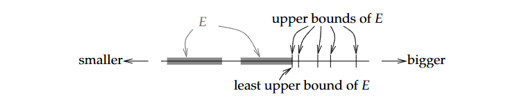

# 1.1. Các tính chất cơ bản

**Định nghĩa 1.1.1. Tập sắp thứ tự (ordered set):** Là tập hợp S đi kèm quan hệ thứ tự "<" thỏa mãn hai điều kiện:

1. *Tính tam phân (Trichotomy)*: $\forall x, y \in S$, chỉ có đúng ba trường hợp $x < y, x > y, x = y$ xảy ra.

2. *Tính bắc cầu (Transitivity)*: Nếu $x < y$ và $y < z$ thì $x < z$.

Tập số hữu tỉ $\mathbb{Q}$, hay số tự nhiên và số nguyên đều là tập số thứ tự.

Ngoài tập số, còn có các kiểu tập hợp sắp thứ tự khác. Ví dụ trong từ điển, các từ có tính chất bắc cầu và tam phân, dựa trên bảng chữ cái để xét thằng nào lớn hơn, bé hơn.

**Định nghĩa 1.1.2. Chặn trên, chặn dưới, và Tập bị chặn:** 

Gọi $E \subset S$, trong đó $S$ là một tập có thứ tự:

(i) Nếu tồn tại một $b \in S$, mà $x \leq b, \forall x \in E$, thì ta nói rằng E bị chặn trên và b là cận trên của E.

(ii) Nếu tồn tại một $b \in S$, mà $x \geq b, \forall x \in E$, thì ta nói rằng E bị chặn dưới và b là cận dưới của E.

(iii) Nếu tồn tại một cận dưới $b_0$ của E mà $b_0 \leq b$, với b là mọi cận trên của E. Thì ta gọi $b_0$ là cận trên nhỏ nhất (least upper bound) hoặc là *supremum* của E. Ta ký hiệu:

$$
\sup E := b_0
$$

(iv) Tương tự, nếu tồn tại một cận dưới $b_0$ của E mà $b_0 \geq b$, với b là cận dưới của E. Thì ta gọi $b_0$ là cận dưới lớn nhất (greatest lower bound) hoặc là *infimum* của E. Ta ký hiệu:

$$
\inf E := b_0
$$

Khi một tập E vừa bị chặn trên và bị chặn dưới, ta đơn giản nói rằng tập E bị chặn.

Một ví dụ đơn giản: Gọi $S := \{a, b, c, d, e\}$ được sắp xếp theo thứ tự $a < b < c < d < e$, và gọi $E := \{a, c\}$. Thì khi đó c, d, và e là cận trên của E, và c chính là cận trên nhỏ nhất hay supremum của E.

Một supremum hoặc infimum của E không nhất thiết phải nằm trong E. Ví dụ, tập $E:=\{x \in \mathbb Q : x < 1\}$ có supremum là 1, nhưng 1 không nằm trong E.

**Định nghĩa 1.1.3. Tính Least-upper-bound** 

Một tập có thứ tự S, có tính leastupperbound nếu với mỗi tập con không rỗng $E \subset S$ đều bị chặn trên và có cận trên nhỏ nhất.

$$
\sup E \in S
$$

Tính chặn trên nhỏ nhất thường được gọi là tính chất hoàn chỉnh *(completeness property)* hoặc tính chất hoàn chỉnh Dedekind *(Dedekind completeness property)*. Và số thực có tính chất này.

**Ví dụ 1.1.4.**

Tập hợp số hữu tỉ $\mathbb{Q}$ không có tính chất hoàn chỉnh. Ví dụ như tập con $\{x \in \mathbb Q : x^2 < 2\}$ không có supremum trong $\mathbb{Q}$.

Việc Q koong có tính chất leastupperbound là một trong những lý do quan trọng ta làm việc với số thực trong analysis. Tập Q thì ổn với mấy ông đại số, nhưng những analysts cần những tính chất leastupperbound để làm việc.

**Định nghĩa 1.1.5. Trường:**

Một tập hợp F được gọi là trường nếu nó thỏa mãn các tiên đề sau:

(A1) If $x, y \in F$ then $x + y \in F$

(A2) $x + y = y + x, \forall x, y \in F$

(A3) $(x + y) + z = x + (y + z), \forall x, y, z \in F$

(A4) $\exists 0\in F : 0 + x = x, \forall x \in F$

(A5) $\forall x \in F, \exists -x \in F : x + (-x) = 0$

(M1) If $x, y \in F$ then $xy \in F$

(M2) $xy = yx, \forall x, y \in F$

(M3) $(xy)z = x(yz), \forall x, y, z \in F$

(M4) $\exists 1 \in F (1 \neq 0) : 1x = x, \forall x \in F$

(M5) $\forall x \in F (x \neq 0), \exists 1/x \in F : x(1/x) = 1$

(DL)  $x(y + z) = xy + xz, \forall x, y, z \in F$

**Ví dụ 1.1.6.**

Tập hợp số hữu tỉ Q là một trường. Tập hợp số nguyên N không phải là trường (vi phạm điều M5).

**Định nghĩa 1.1.7. Trường có thứ tự:**

Một trường F được gọi là có thứ tự nếu F là một tập hợp có thứ tự và:

(i) $\forall x, y, z \in F, x < y \implies x + z < y + z$

(ii) $\forall x, y \in F :  x, y > 0 \implies xy > 0$

**Mệnh đề 1.1.8.** Cho F là một trường có thứ tự và $x, y, z \in F$. Khi đó:

(i) If $x > 0$ then $-x < 0$ *(vice versa)*.

(ii) If $x > 0$ and $y < z$ then $xy < xz$.

(iii) If $x < 0$ and $y < z$ then $xy > xz$

(iv) If $x \neq 0$ then $x^2 > 0$.

(v) If $0 < x < y$ then $0 < \frac 1 y < \frac 1 x$.

(vi) If $0 < x < y$ then $x^2 < y^2$.

(vii) If $x \leq y$ and $z \leq w$ then $x + z \leq y + w$.

# 1.2. Tập hợp các số thực

## 1.2.1. Tập hợp các số thực

**Định lý 1.2.1.** Tồn tại duy nhất một trường có thứ tự $\mathbb{R}$ với tính chất leastupperbound mà $\mathbb{Q} \subset \mathbb{R}$.

**Mệnh đề 1.2.2.** Nếu tồn tại $x \in \mathbb{R}$ mà $x \leq \epsilon, \forall \epsilon \in \mathbb{R}, (\epsilon > 0)$, khi đó $x \leq 0$.

## 1.2.2. Tính chất Archimedes

**Định lý 1.2.4.**

(i) *Tính chất Achimedes:* $x, y \in \mathbb{R}, \exists n \in \mathbb{N} : nx > y$

(ii) *$\mathbb{Q}$ dày đặc trong $\mathbb{R}$:* $x, y \in \mathbb{R}, \exists r \in \mathbb{Q} : x < r < y$

**Hệ quả 1.2.5.** $\inf \left\{\frac 1 n : n \in \mathbb{N}\right\}$

## 1.2.3. Sử dụng supremum và infimum

Suprema và Infima hoàn toàn tương thích với các biểu thức đại số. Cho một tập hợp con $A \subset \mathbb{R}$ và $x \in \mathbb{R}$, chúng ta định nghĩa:

$$
x + A := \{x + y \in \mathbb{R} : y \in A\} \\ 
xA := \{xy \in \mathbb{R} : y \in A\}
$$

**Mệnh đề 1.2.6.** Cho $A \subset \mathbb{R}$ không rỗng:

(i) If $x \in \mathbb{R}$ and A is bounded above, then $\sup(x + A) = x + \sup A$

(ii) If $x \in \mathbb{R}$ and A is bounded below, then $\inf(x + A) = x + \inf A$

(iii) If $x > 0$ and A is bounded above, then $\sup(xA) = x(\sup A)$

(iv) If $x > 0$ and A is bounded below, then $\inf(xA) = x(\inf A)$

(v) If $x < 0$ and A is bounded below, then $\sup(xA) = x(\inf A)$

(vi) If $x < 0$ and A is bounded above, then $\inf(xA) = x(\sup A)$

**Mệnh đề 1.2.7.** Cho hai tập hợp $A, B \subset \mathbb{R}$ không rỗng, và $x \leq y, x \in \mathbb{A}, y \in \mathbb{B}$. Sau đó thì A bị chặn trên, B bị chặn dưới, khi đó $\sup A \leq \inf B$.

**Mệnh đề 1.2.8.** Nếu $S \subset \mathbb{R}$ không rỗng và bị chặn trên, thì sau đó với mỗi $\epsilon > 0$, tồn tại một $x \in S$ mà $(\sup S) - \epsilon < x \leq \sup S$

Để sử dụng suprema và infima thuận tiện và dễ dàng hơn nữa, ta muốn viết $\sup A$ và $\inf A$ mà không cần phải lo lắng gì về việc A có bị chặn hay rỗng hay không, ta sẽ định nghĩa một số thứ như sau.

**Định nghĩa 1.2.9.** Cho $A \subset \mathbb{R}$ là một tập:

(i) Nếu A rỗng, thì $\sup A := -\infty$

(ii) Nếu A không bị chặn trên, thì $\sup A := \infty$

(iii) Nếu A rỗng thì $\inf A := \infty$

(iv) Nếu A không bị chặn dưới, thì $\inf A := -\infty$

**Định nghĩa 1.2.10. Tập số thực mở rộng:**

$$
\mathbb{R}^* := \mathbb{R} \cup \{-\infty, \infty\}
$$

mà ở đó:

$$
-\infty < \infty \qquad 
-\infty < x \qquad 
x < \infty \qquad 
\forall x \in \mathbb{R}
$$
 
## 1.2.4. Maxima và minima

Nó cũng tương tự như supremum và infimum, nhưng thường đước sử dụng trong các tập hữu hạn thay vì vô hạn. Và cũng có ý chỉ rằng supremum của tập cũng nằm trong tập (vice versa). 

Có thể nói rằng supremum và infimum dùng trong các tập vô hạn, và không nhất thiết chúng phải nằm trong tập đó. Còn maximum và minimum dùng trong các tập hữu hạn và chúng phải nằm trong tập đó.

# 1.3. Giá trị tuyệt đối và hàm bị chặn

Một khái niệm mà chúng ta sẽ gặp đi gặp lại nhiều lần đó chính là giá trị tuyết đối. Here is the formal defination:

$$
|x| := \begin{cases}
x & \text{if} \ x \geq 0 \\ 
-x & \text{if} \ x < 0
\end{cases}
$$

**Mệnh đề 1.3.1.**

(i) $|x| \geq 0, |x| = 0$ khi và chỉ khi $x = 0$.

(ii) $|-x| = |x|, \forall x \in \mathbb{R}$

(iii) $|xy| = |x||y|, \forall x, y \in \mathbb{R}$

(iv) $|x|^2 = x^2, \forall x \in \mathbb{R}$

(v) $|x| \leq y$ khi và chỉ khi $-y \leq x \leq y$

(vi) $-|x| \leq x \leq |x|, \forall x \in \mathbb{R}$

**Mệnh đề 1.3.2. Bất đẳng thức tam giác:**

$$
|x + y| \leq |x| + |y|, \forall x, y \in \mathbb{R}
$$

**Hệ quả 1.3.3.** Cho $x, y \in \mathbb{R}$

(i) Bất đẳng thức tam giác ngược: $||x| - |y|| \leq |x - y|$.

(ii) $|x - y| \leq |x| + |y|$

**Hệ quả 1.3.4.** Cho $x_1, x_2, ..., x_n \in \mathbb{R}$, khi đó:

$$
|x_1 + x_2 + ... + x_n| \leq |x_1| + |x_2| + ... + |x_n|
$$

**Định nghĩa 1.3.6.** Giả sử rằng $f : D \rightarrow \mathbb{R}$ là một hàm. Ta gọi f bị chặn nếu tồn tại một số M sao cho $|f(x)| \leq M, \forall x \in D$.

Với hàm $f : D \rightarrow \mathbb{R}$, ta viết 

$$
\sup_{x \in D} f(x) := \sup f(D) \qquad 
\inf_{x \in D} f(x) := \inf f(D)
$$

Ta cũng có thể thay $x \in D$ bằng biểu thức, ví dụ như:

$$
\sup_{x \in D} f(x) = \sup_{-1\leq x\leq 5}(x^2 - 9x + 1) = 11
$$

**Mệnh đề 1.3.7.** Nếu $f : D \rightarrow \mathbb{R}$ và $g : D \rightarrow \mathbb{R}$ và 

$$
f(x) \leq g(x) \qquad \forall x \in D
$$

thì khi đó:

$$
\sup_{x \in D} f(x) \leq \sup_{x \in D} g(x) \qquad 
\inf_{x \in D} f(x) \leq \inf_{x \in D} g(x)
$$

# 1.4. Khoảng và kích thước của $\mathbb{R}$

Here is a formal defination of intervals. $\forall a, b \in \mathbb{R}, a < b$, chúng ta định nghĩa rằng:

$$
[a, b] := \{x\in \mathbb{R} : a \leq x \leq b\}, \\ 
(a, b) := \{x\in \mathbb{R} : a < x < b\}, \\ 
(a, b] := \{x\in \mathbb{R} : a < x \leq b\}, \\ 
[a, b) := \{x\in \mathbb{R} : a \leq x < b\}.
$$

The interval [a, b] is called a *closed interval* and (a, b) is called an *open interval*. The intervals of the form (a, b] and [a, b) are called *half-open intervals*.

4 khoảng, nửa khoảng, đoạn ở trên được gọi là các khoảng bị chặn, trong đó a và b là số thực. Ta định nghĩa khoảng không bị chặn như sau:

$$
[a, \infty] := \{x\in \mathbb{R} : a \leq x\}, \\ 
(a, \infty) := \{x\in \mathbb{R} : a < x\}, \\ 
(-\infty, b] := \{x\in \mathbb{R} : x \leq b\}, \\ 
[-\infty, b) := \{x\in \mathbb{R} : x < b\}.
$$

**Mệnh đề 1.4.1.**

Một tập hợp con $I \subset \mathbb{R}$ được gọi là khoảng khi và chỉ khi I chứa ít nhất 2 điểm và với mọi $a, c \in I$ và $b \in \mathbb{R}$ sao cho $a < b < c$, chúng ta có $b \in I$.

