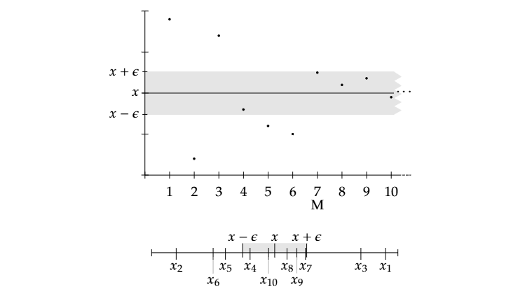
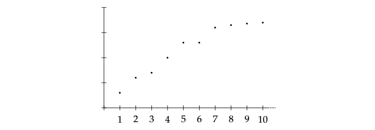
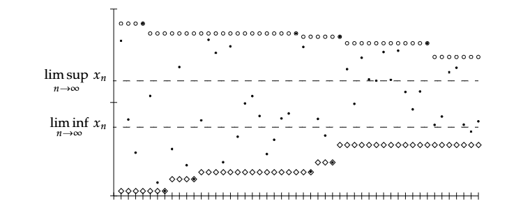

# 2.1. Chuỗi và giới hạn

Để nói đến analysis thì cần thiết phải nói đến giưới hạn. Kiểu giới hạn đơn giản nhất của giới hạn là giới hạn của chuỗi số thực. Here is the formal definition.

**Định nghĩa 2.1.1. Chuỗi (của dãy số thực):** là một hàm $x : \mathbb{N} \rightarrow \mathbb{R}$. Thay vì $x(n)$, chúng ta thường dùng ký hiệu chỉ phần tử thứ n của chuỗi là $x_n$. Để ký hiệu một chuỗi, ta viết:

$$
\{x_n\}_{n = 1}^{\infty}
$$

Một chuỗi $\{x_n\}_{n = 1}^{\infty}$ bị chặn nếu hàm cơ bản của nó bị chặn. Hay:

$$
\exists B \in \mathbb{R} : |x_n| \leq B \qquad \forall n \in \mathbb{N} 
$$

Nói cách khác, chuỗi bị chặn khi tập $\{x_n : n \in \mathbb{N}\}$ bị chặn. 

**Định nghĩa 2.1.2. Hội tụ:**

Một chuỗi $\{x_n\}_{n = 1}^\infty$ được gọi là hội tụ về một số $x_0 \in \mathbb{R}$ nếu với mỗi $\epsilon > 0$, tồn tại một số $M \in \mathbb{N}$ sao cho $|x_n - x_0| < \epsilon$ với tất cả $n \geq M$.

Số $x_0$ được gọi là giới hạn của chuỗi.

$$
\lim_{n \rightarrow \infty} x_n := x_0 \ \text{if} \ \forall \epsilon > 0, \exists M : |x_n - x_0| < \epsilon \ \forall n \geq M
$$

Chuỗi không hội tụ thì được gọi là chuỗi phân kỳ.

Nói ngắn gọn hơn, ở **Mệnh đề 2.1.6.** chúng ta sẽ chứng minh tại sao giới hạn x luôn luôn là duy nhất (nếu nó tồn tại). Thật hợp lý khi nói về giới hạn của một dãy số và chúng ta chỉ cần chứng minh rằng dãy số đó hội tụ về một số nào đó.

Intuitively, giới hạn là x có nghĩa là cuỗi cùng mọi số trong chuỗi đều tiến gần tới số x.  

khi chúng ta viết $\lim_{n \rightarrow \infty} x_n = x$ cho một số thực x bất kỳ, chúng ta biết hai thứ. Thứ nhất, chuỗi hội tụ, và thứ hai giới hạn là x.

Và định nghĩa ở trên là một trong những định nghĩa quan trọng trong analysis, và nó cần thiết để hiểu analysis một cách hoàn hảo. Điểm mấu chốt của định nghĩa là dù với bất kỳ $\epsilon >0$ nào, thì chúng ta cũng sẽ tìm được M tương ứng. 

**Mệnh đề 2.1.6.**

Một chuỗi hội tụ có duy nhất một giới hạn.

*Proof:* 

Giả sử rằng chuỗi $\{x_n\}_{n = 1}^\infty$ có hai giới hạn là x và y, thì khi đó ta tìm được M1 và M2 tương ứng, sao cho:

$$
|x_n - x| < \epsilon, \ \forall n \leq M_1
|x_n - y| < \epsilon, \ \forall n \leq M_2
$$

$$
|x - y| = |-x_n + x + x_n - y| = |(x_n - y) - (x_n - x)| \leq |x_n - y| + |x_n - x| \leq \epsilon + \epsilon = 2\epsilon
$$

Bởi vì $|y - x| < \epsilon, \forall \epsilon > 0 \implies |x - y| = 0 \implies x = y$. Vì vậy, giới hạn (nếu tồn tại) là duy nhất.

**Mệnh đề 2.1.7.** Một chuỗi hội tụ thì bị chặn.

*Proof:*

Giả sử rằng chuỗi hội tụ về x. Từ đó $\exists M \in \mathbb{N}$ sao cho $\forall n \geq M$, chúng ta có $|x_n - x| < \epsilon$. 

$$
|x_n| = |x_n - x + x| \leq |x_n - x| + |x| = \epsilon + |x|
$$

Từ đây ta có một tập hữu hạn, B, định nghĩa là:

$$
B := \max \{x_1, x_2, ..., x_{m - 1}, \epsilon + |x|\}
$$

Vì vậy, $\forall x \in \mathbb{N}, |x_n| \leq B$

Và, dãy hội tụ thì bị chặn, nhưng dãy bị chặn thì chưa chắc đã hội tụ.

## 2.1.1. Chuỗi đơn điệu

Một trong những kiểu đơn giản nhất của chuỗi chính là chuỗi đơn điệu.

**Định nghĩa 2.1.9. Chuỗi tăng đơn điệu:**

Một chuỗi $\{x_n\}_{n = 1}^\infty$ được gọi là tăng đơn điệu nếu $x_n \leq x_{n + 1}, \forall n \in \mathbb{N}$.

Một chuỗi $\{x_n\}_{n = 1}^\infty$ được gọi là giảm đơn điệu nếu $x_n \geq x_{n + 1}, \forall n \in \mathbb{N}$.

Nếu một chuỗi tăng đơn điệu hoặc giảm đơn điệu, ta gọi dãy là dãy đơn điệu.

Ví dụ, $\{n\}_{n = 1}^\infty$ được gọi là tăng đơn điệu, $\left\{\frac 1 n\right\}_{n = 1}^\infty$ là giảm đơn điệu, và $\{(-1)^n\}_{n = 1}^\infty$ không là chuỗi đơn điệu.

**Định lý 2.1.10. Monotone Convergence theorem:**

Một chuỗi đơn điệu $\{x_n\}_{n = 1}^\infty$ bị chặn khi và chỉ khi nó hội tụ.

Hơn nữa, nếu $\{x_n\}_{n = 1}^\infty$ là đơn điệu tăng và bị chặn, thì

$$
\lim_{n \rightarrow\infty} x_n = \sup\{x_n : n \in \mathbb{N}\}
$$

Nếu $\{x_n\}_{n = 1}^\infty$ là đơn điệu giảm và bị chặn, thì:

$$
\lim_{n \rightarrow\infty} x_n = \inf\{x_n : n \in \mathbb{N}\}
$$

**Mệnh đề 2.1.13.** Gọi $S \subset \mathbb{R}$ là một tập không rỗng và bị chặn. Khi đó tồn tại hai chuỗi đơn điệu $\{x_n\}_{n = 1}^\infty$ và $\{y_n\}_{n = 1}^\infty$, sao cho $x_n, y_n \in S$ và

$$
\sup S = \lim_{n\rightarrow\infty}x_n \qquad 
\inf S = \lim_{n\rightarrow\infty}y_n
$$

## 2.1.2. Đuôi của chuỗi

**Định nghĩa 2.1.14.**

Với chuỗi $\{x_n\}_{n = 1}^\infty$, K-tail ($K \in \mathbb{N}$), hay ngắn gọn hơn là đuôi của $\{x_n\}_{n = 1}^\infty$ là chuỗi bắt đầu từ $K + 1$, và chúng ta thường viết là:

$$
\{x_{n + K}\}_{n = 1}^\infty \qquad \text{or} \qquad
\{x_n\}_{n = K + 1}^\infty
$$

**Mệnh đề 2.1.15.**

Gọi $\{x_n\}_{n = 1}^\infty$ là một chuỗi. Các khẳng định sau là tương đương:

(i) Chuỗi $\{x_n\}_{n = 1}^\infty$ hội tụ

(ii) Đuôi K $\{x_{n + K}\}_{n = 1}^\infty$ hội tụ $\forall K \in \mathbb{N}$

(iii) Đuôi K $\{x_{n + K}\}_{n = 1}^\infty$ hội tụ với vài $K \in \mathbb{N}$

Hơn nữa, với bất kỳ (và do đó là tất cả) các giới hạn tồn tại, thì $\forall K \in \mathbb{N}$

$$
\lim_{n\rightarrow\infty} x_n = \lim_{n\rightarrow\infty} x_{n + K}
$$

## 2.1.3. Chuỗi con 

Nó rất là hữu ít nếu đôi lúc ta chỉ xét một số phần tử của chuỗi. Một chuỗi con $\{x_n\}_{n = 1}^\infty$ là một chuỗi chứa một hoặc một vài số trong $\{x_n\}_{n = 1}^\infty$ có cùng thứ tự.

**Định nghĩa 2.1.16.** Gọi $\{x_n\}_{n = 1}^\infty$ là một chuỗi. $\{n_i\}_{n = 1}^\infty$ là một chuỗi tăng ngặt của số tự nhiên, tức là $n_i < n_{i + 1}, \forall i \in \mathbb{N}$. Chuỗi:

$$
\{x_{n_i}\}_{n = 1}^\infty
$$

được gọi là chuỗi con của $\{x_n\}_{n = 1}^\infty$.

**Mệnh đề 2.1.17.** Nếu $\{x_n\}_{n = 1}^\infty$ là một chuỗi hội tụ, thì với mỗi chuỗi con $\{x_{n_i}\}_{n = 1}^\infty$ đều hội tụ, và:

$$
\lim_{n\rightarrow\infty}x_n = \lim_{n\rightarrow\infty}x_{n_i}
$$

# 2.2. Một số thông tin về chuỗi

## 2.2.1. Giới hạn và bất đẳng thức

Một bổ đề cơ bản của giới hạn và bất đẳng thức là bổ đề kẹp. Nó cho phép chúng ta chứng minh sự hội tụ của một chuỗi khó trong trường hợp chúng ta tìm được hai chuỗi hội tụ đơn giản hơn mà kẹp chuỗi khó ban đầu.

**Bổ đề 2.2.1. Bổ đề kẹp - Squeeze lenma:**

Gọi $\{a_n\}_{n = 1}^\infty$, $\{b_n\}_{n = 1}^\infty$ và $\{x_n\}_{n = 1}^\infty$ là chuỗi sao cho:

$$
a_n \leq x_n \leq b_n \qquad \forall n \in \mathbb{N}
$$

Giả sử $\{a_n\}_{n = 1}^\infty$ và $\{b_n\}_{n = 1}^\infty$ hội tụ và 

$$
\lim_{n \rightarrow\infty} a_n = \lim_{n\rightarrow\infty}b_n
$$

Thì khi đó $\{x_n\}_{n = 1}^\infty$ hội tụ và:

$$
\lim_{n \rightarrow\infty} a_n = \lim_{n\rightarrow\infty}b_n = \lim_{n\rightarrow\infty}x_n
$$

*Proof:* Chứng minh $\{x_n\}_{n = 1}^\infty$ hội tụ và hội tụ về x.

Ta có:

* $a_n$ hội tụ tại x $\implies |a_n - x| < \epsilon \implies -\epsilon < a_n - x$

* $b_n$ hội tụ tại x $\implies |b_n - x| < \epsilon \implies b_n - x < \epsilon$

Theo đề bài, ta có:

$$
a_n \leq x_n \leq b_n, \forall n \in \mathbb{N} \\ 
a_n - x \leq x_n - x \leq b_n - x
$$

Mà $-\epsilon < a_n - x$ và $b_n - x < \epsilon$, suy ra:

$$
-\epsilon < x_n - x < \epsilon \\ 
\implies |x_n - x| < \epsilon
$$

Vậy chuỗi $\{x_n\}_{n = 1}^\infty$ hội tụ, và hội tụ về x. 

**Bổ đề 2.2.3.**

Gọi $\{x_n\}_{n = 1}^\infty$ và $\{y_n\}_{n = 1}^\infty$ là chuỗi hội tụ và 

$$
x_n \leq y_n \qquad \forall n \in \mathbb{N}
$$

thì khi đó

$$
\lim_{n\rightarrow\infty}x_n \leq \lim_{n\rightarrow\infty}y_n
$$

**Hệ quả 2.2.4.**

(i) Nếu $\{x_n\}_{n = 1}^\infty$ là một chuỗi hội tụ sao cho $x_n \geq 0, \forall n \in \mathbb{N}$ thì khi đó:

$$
\lim_{n\rightarrow\infty}x_n\geq 0
$$

(ii) Gọi $a, b \in \mathbb{R}$ và $\{x_n\}_{n = 1}^\infty$ là một chuỗi tụ, sao cho:

$$
a \leq x_n \leq b \qquad \forall n \in \mathbb{N}
$$

thì khi đó:

$$
a \leq \lim_{n\rightarrow\infty}x_n \leq b 
$$

## 2.2.2. Tính liên tục của các phép toán đại số

**Mệnh đề 2.2.5.** 

Cho hai dãy số hội tụ $\{x_n\}_{n = 1}^\infty$ và $\{y_n\}_{n = 1}^\infty$.

(i) Dãy $\{z_n\}_{n = 1}^\infty$, mà $z_n := x_n + y_n$ hội tụ và:

$$
\lim_{n\rightarrow\infty} (x_n + y_n) =
\lim_{n\rightarrow\infty} z_n = 
\lim_{n\rightarrow\infty} x_n +
\lim_{n\rightarrow\infty} y_n 
$$

(ii) Dãy $\{z_n\}_{n = 1}^\infty$, mà $z_n := x_n - y_n$ hội tụ và:

$$
\lim_{n\rightarrow\infty} (x_n - y_n) = 
\lim_{n\rightarrow\infty} z_n = 
\lim_{n\rightarrow\infty} x_n - 
\lim_{n\rightarrow\infty} y_n
$$

(iii) Dãy $\{z_n\}_{n = 1}^\infty$, mà $z_n := x_ny_n$ hội tụ và:

$$
\lim_{n\rightarrow\infty} (x_ny_n) = 
\lim_{n\rightarrow\infty} z_n = 
\left(\lim_{n\rightarrow\infty} x_n\right) 
\left(\lim_{n\rightarrow\infty} y_n\right)
$$

(iv) Nếu $\lim_{n\rightarrow\infty} y_n \neq 0, \forall n \in \mathbb{N}$, thì khi đó dãy $\{z_n\}_{n = 1}^\infty$, mà $z_n := \frac {x_n} {y_n}$ hội tụ và:

$$
\lim_{n\rightarrow\infty} (x_n - y_n) = 
\lim_{n\rightarrow\infty} z_n = 
\frac {\lim_{n\rightarrow\infty} x_n}
{\lim_{n\rightarrow\infty} y_n}
$$

**Mệnh đề 2.2.6.**

Cho $\{x_n\}_{n = 1}^\infty$ làm một dãy hội tụ, sao cho $\x_n \geq 0, \forall n \in \mathbb{N}$, thì khi đó:

$$
\lim_{n\rightarrow\infty} \sqrt{x_n} = \sqrt {\lim_{n\rightarrow\infty} x_n}
$$

**Mệnh đề 2.2.7.**

Cho $\{x_n\}_{n = 1}^\infty$ là một dãy hội tụ, thì khi đó $\{|x_n|\}_{n = 1}^\infty$ hội tụ và

$$
\lim_{n\rightarrow\infty} |x_n| = \left|\lim_{n\rightarrow\infty} x_n \right|
$$

## 2.2.4. Một số tiêu chuẩn hội tụ

**Mệnh đề 2.2.10.**

Cho $\{x_n\}_{n = 1}^\infty$ là một dãy. Giả sử rằng tồn tại một số $x \in \mathbb{R}$ và một dãy hội tụ $\{a_n\}_{n = 1}^\infty$, sao cho:

$$
\lim_{n\rightarrow\infty} a_n = 0
$$

và 

$$
|x_n - x| \leq a_n \qquad \forall n \in \mathbb{N}
$$

Thì khi đó $\{x_n\}_{n = 1}^\infty$ hội tụ và $\lim_{n\rightarrow\infty} x_n = x$.

**Mệnh đề 2.2.11.**

Cho $c > 0$:

(i) Nếu $c < 1$, thì khi đó

$$
\lim_{n\rightarrow\infty} c^n = 0
$$

(ii) Nếu $c > 1$, thì khi đó $\{c_n\}_{n = 1}^\infty$ không bị chặn.

**Bổ đề 2.2.12. Tiêu chuẩn tỉ số Leibniz:**

Cho $\{x_n\}_{n = 1}^\infty$ là một chuỗi, sao cho $x_n \neq 0, \forall n$ và sao cho tồn tại giới hạn:

$$
L := \lim_{n\rightarrow\infty} \frac {|x_{n + 1}|}{|x_n|}
$$

(i) Nếu $L < 1$, thì khi đó chuỗi hội tụ và $\lim_{n\rightarrow\infty} x_n = 0$

(ii) Nếu $L > 1$, thì khi đó chuỗi không bị chặn và phân kỳ.

---
# 2.3. Giới hạn trên, giới hạn dưới và Bolzano - Weierstrass

## 2.3.1. Giới hạn trên và giới hạn dưới

Nếu dãy $\{x_n\}_{n = 1}^\infty$ bị chặn, thì khi đó tập $\{x_k : k \in \mathbb{N}\}$ bị chặn.
$\forall n, \{x_k : k \geq n\}$ cũng bị chặn, nên ta lấy supremum và infimum của nó.

**Định nghĩa 2.3.1.**

Cho $\{x_n\}_{n = 1}^\infty$ là một chuỗi bị chặn. Ta định nghĩa $\{a_n\}_{n = 1}^\infty$ và $\{b_n\}_{n = 1}^\infty$ bằng $a_n := \sup\{x_k : k \geq n\}$ và $b_n := \inf\{x_k : k \geq n\}$. Nếu tồn tại giới hạn, thì:

$$
\lim_{n\rightarrow\infty} \sup x_n := \lim_{n\rightarrow\infty} a_n \qquad 
\lim_{n\rightarrow\infty} \sup x_n := \lim_{n\rightarrow\infty} b_n 
$$

Với một chuỗi bị chặn, thì luôn tồn tại limsup và liminf. Và với những dãy không bị chặn thì limsup và liminf có thể là $-\infty$ và $\infty$.

**Mệnh đề 2.3.2.**

Cho $\{x_n\}_{n = 1}^\infty$ là dãy bị chặn. Và $a_n, b_n$ có cùng định nghĩa với định nghĩa 2.3.1. trên.

(i) Dãy $\{a_n\}_{n = 1}^\infty$ bị chặn đơn điệu giảm, và $\{b_n\}_{n = 1}^\infty$ bị chặn đơn điệu tăng. Đặc biệt, $\lim_{n\rightarrow\infty} \inf x_n$ và $\lim_{n\rightarrow\infty} \sup x_n$ tồn tại.

(ii) $\lim_{n\rightarrow\infty} \sup x_n = \inf\{a_n : n \in \mathbb{N}\}$ và $\lim_{n\rightarrow\infty} \inf x_n = \sup\{b_n : n \in \mathbb{N}\}$

(iii) $\lim_{n\rightarrow\infty} \inf x_n \leq \lim_{n\rightarrow\infty} \sup x_n$

**Định lý 2.3.4.** 
Nếu $\{x_n\}_{n = 1}^\infty$ là một dãy bị chặn, thì khi đó tồn tại một chuỗi con $\{x_{n_k}\}_{k = 1}^\infty$ sao cho:

$$
\lim_{k\rightarrow\infty} x_{n_k} = \lim_{n\rightarrow\infty} \sup x_n
$$

Tương tự, tồn tại (đôi lúc khác) một chuỗi con $\{x_{m_k}\}_{k = 1}^\infty$ sao cho:

$$
\lim_{k\rightarrow\infty} x_{m_k} = \lim_{n\rightarrow\infty} \inf x_n
$$

## 2.3.2. Sử dụng liminf và limsup 

**Mệnh đề 2.3.5.**

Cho $\{x_n\}_{n = 1}^\infty$ là một dãy bị chặn. Khi đó, chuỗi bị chặn khi và chỉ khi:

$$
\liminf_{n\rightarrow\infty} x_n = \limsup_{n\rightarrow\infty} x_n
$$

Hơn nữa, nếu chuỗi hội tụ, thì khi đó:

$$
\lim_{n\rightarrow\infty} x_n = \liminf_{n\rightarrow\infty} x_n = \limsup_{n\rightarrow\infty} x_n
$$

**Mệnh đề 2.3.6.**

Giả sử $\{x_n\}_{n = 1}^\infty$ bị chặn và $\{x_{n_k}\}_{k = 1}^\infty$ là chuỗi con. Khi đó:

$$
\liminf_{n\rightarrow\infty} x_n \leq 
\liminf_{k\rightarrow\infty} x_{n_k} \leq 
\limsup_{k\rightarrow\infty} x_{n_k} \leq 
\limsup_{n\rightarrow\infty} x_n \leq 
$$

**Mệnh đề 2.3.7.** Một chuỗi bị chặn $\{x_n\}_{n = 1}^\infty$ hội tụ và hội tụ về một điểm x khi và chỉ khi mọi dãy con hội tụ của nó $\{x_{n_k}\}_{k = 1}^\infty$ đều hội tụ về x.

## 2.3.3. Định lý Bolzano-Weierstrass

Không phải tất cả các dãy bị chặn đều hội tụ, nhưng mà định lý Bolzano-Weierstrass cho ta biết rằng ít nhất ta có thể kiếm được một dãy con hội tụ.

**Định lý 2.3.8. Bolzano-Weierstrass:**

Giả sử một dãy $\{x_n\}_{n = 1}^\infty$ của tập số thực bị chặn. Thì khi đó tồn tại một chuỗi con hội tụ $\{x_{n_i}\}_{i = 1}^\infty$.

## 2.3.4. Giới hạn vô hạn

**Định nghĩa 2.3.9.**

Chúng ta nói rằng $\{x_n\}_{n = 1}^\infty$ phân kỳ tới vô hạn, nếu $\forall K \in \mathbb{R}, \exists M \in \mathbb{N} : x_n > K, \forall n \geq M$. Khi đó, ta viết:

$$
\lim_{n\rightarrow\infty} x_n := \infty
$$

Tương tự, $\forall K \in \mathbb{R}, \exists M \in \mathbb{N} : x_n < K, \forall n \geq M$. Chúng ta nói rằng $\{x_n\}_{n = 1}^\infty$ phân kỳ tới âm vô cực và chúng ta viết:

$$
\lim_{n\rightarrow\infty} x_n := -\infty
$$

**Mệnh đề 2.3.10.**

Giả sử $\{x_n\}_{n = 1}^\infty$ là một dãy đơn điệu không bị chặn, thì khi đó:

$$
\lim_{n\rightarrow\infty} x_n = \begin{cases}
\infty & \text{if} \ \{x_n\}_{n = 1}^\infty \ \text{is increasing}, \\
-\infty & \text{if} \ \{x_n\}_{n = 1}^\infty \ \text{is decreasing}, \\
\end{cases}
$$

# Dãy Cauchy

Hạn chế của định nghĩa giới hạn thông thường: Khi định nghĩa dãy $\{x_n\}$ hội tụ về x ($\lim x_n = x$), ta bắt buộc phải biết trước giá trị của x để kiểm tra $|x_n - x| < \epsilon$. Tuy nhiên, trong thực tế nhiều bài toán analysis, ta không biết trước giới hạn x là bao nhiêu nhưng vẫn cần chứng minh dãy đó hội tụ hay không.

Giải pháp của Cauchy: Thay vì so sánh các số hạng $x_n$ với một điểm giới hạn x bên ngoài, ta so sánh khoảng cách giữa chính các số hạng với nhau khi chỉ số n và k tiến ra vô cùng.

**Định nghĩa 2.4.1. Dãy Cauchy:**

Một dãy được gọi là dãy Cauchy nếu với mọi $\epsilon > 0$ tồn tại một $M \in \mathbb{N}$ sao cho với mọi $n \geq M, k \geq M$, chúng ta có:

$$
|x_n - x_k| < \epsilon
$$

Một cách không chính thức thì dãy Cauchy có nghĩa là các số hạng cuối của dãy ngày càng gần nhau hơn. Và ta có mong rằng dãy hội tụ, và với $\mathbb{R}$ với tính chất leastupperbound, thì điều này đúng.

**Mệnh đề 2.4.4.**

Nếu một dãy là dãy Cauchy, thì khi đó, dãy hội tụ.

**Định lý 2.4.5.**

Một dãy số thực là dãy Cauchy, khi và chỉ khi nó hội tụ.

**Nhận xét 2.4.6.**

Tầm quan trọng và Ứng dụng rộng hơn (Cauchy-completeness)

(i) Sự khác biệt giữa $\mathbb{Q}$ và $\mathbb{R}$:

* Trong tập số hữu tỉ $\mathtt{Q}$, có những dãy Cauchy gồm toàn số hữu tỉ nhưng giới hạn lại là số vô tỷ. Do đó Q không đầy đủ.

* Việc mọi dãy Cauchy trong R đều hội tụ về một điểm thuộc R được gọi là tính đầy đủ Cauchy của tập số thực.

(ii) Nền tảng cho Metric space

* Trong không gian metric $(X, d)$, khái niệm dãy Cauchy được tổng quát hoá thành $d(x_n, x_k) < \epsilon$. Không gian metric mà mọi dãy Cauchy đều hội tụ được gọi là **Không gian metric đầy đủ (Complete Metric Space)** vốn là khái niệm trung tâm cho không gian Bannach và giải tích hàm.

# 2.5. Chuỗi

Chuỗi số là một trong những đối tượng nền tảng nhất của toán học và là động lực ban đầu để các nhà toán học xây dựng lý thuyết giải tích chặt chẽ. 

Chuỗi số xuất hiện xuyên suốt trong giải phương trình vi phân và các ứng dụng của khoa học kỹ thuật.

## 2.5.1. Định nghĩa

**Định nghĩa 2.5.1. Chuỗi số:**

Cho dãy số $\{x_n\}_{n = 1}^\infty$, biểu thức có hình thức:

$$
\sum_{n = 1}^\infty x_n \qquad 
\sum x_n
$$

được gọi là chuỗi số.

Một chuỗi hội tụ nếu dãy tổng riêng $\{s_k\}_{k = 1}^\infty$ được định nghĩa bởi:

$$
s_k := \sum_{n = 1}^k = x_1 + x_2 + ... + x_k
$$

hội tụ. Nếu dãy tổng riêng phân kỳ thì chuỗi phân kỳ.

